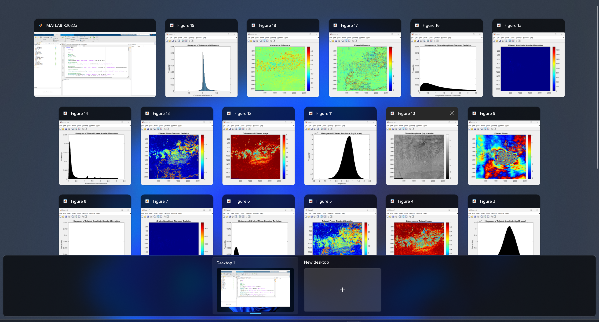

# Goldstein滤波算法及其MATLAB实现

## 文件说明

`main.m`：程序的主函数，负责调用其他函数并绘制GUI界面；

`goldstein_filter.m`：滤波器函数，使用`goldstein_filter(cpx, alpha, window_size, step_size)`来调用，其中`cpx`代表待处理的干涉图复数矩阵，`alpha`代表滤波参数，`window_size`代表窗口大小，`step_size`代表窗口滑动的步长；

`phase2raster.m`：将干涉图输出为`tif`、`jpeg`、`bmp`等格式的栅格图像；

`read_int.m`：将`int`格式的干涉图数据转换为矩阵；

`write_int.m`：将矩阵保存为`int`形式的干涉图数据；

`data`：放置本工程所需要的相关数据；

`data/original`：放置未经滤波的原图像数据，包含`original.int`、`original.int.tif`和`original.int.xml`

`data/filter_fxx_wyy_szz`：放置滤波后的图像数据，`xx`、`yy`、`zz`分别表示滤波参数、窗口大小、窗口滑动步长，如`filter_f0.5_w32_s8`代表滤波参数为0.5、窗口大小为32、窗口滑动步长为8；

`img`：放置`README`文档的图片。

## 使用指南

1. 运行`main.m`脚本，出现如下界面

2. 点击`浏览`，选择待滤波的`int`文件，此处我们选择`original.int`

3. 设置三个参数完毕后，点击`处理`，稍等片刻（等待时间取决于三个滤波参数的选取）

4. 滤波处理完成后会提示`处理完成`，同时会显示三幅干涉图像，分别是原干涉图像、滤波后的干涉图像、原图像和滤波后图像相位的差值；同时，`/data`文件夹下会出现一个名为`filter_f0.5_w32_s8`的文件夹，用以存储滤波后的数据

