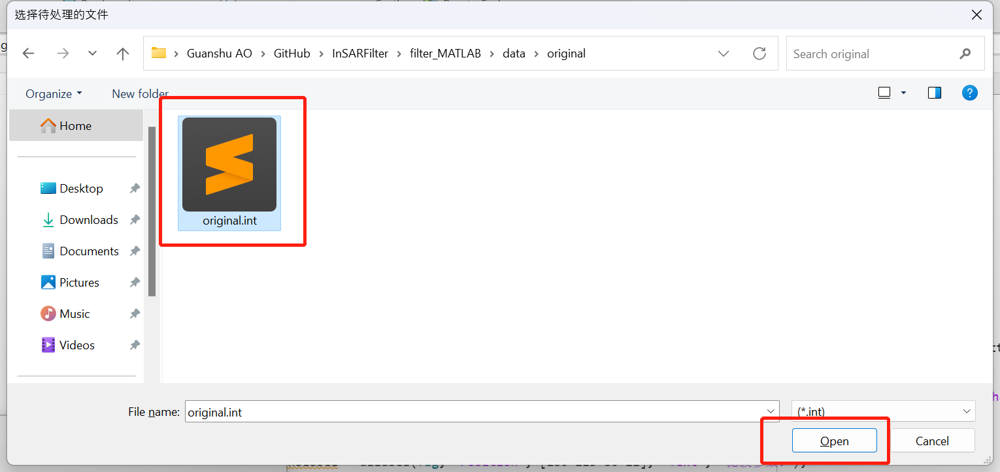

# Goldstein 滤波算法及其 MATLAB 实现

## 文件说明

`main.m`：程序的主函数，负责调用其他函数并绘制 GUI 界面；

`goldstein_filter.m`：Goldstein 滤波器函数，使用`goldstein_filter(cpx, alpha, window_size, step_size)`来调用，其中`cpx`代表待处理的干涉图复数矩阵，`alpha`代表滤波参数，`window_size`代表窗口大小，`step_size`代表窗口滑动的步长；

`zhao_filter.m`：Zhao 滤波器函数；

`yu_filter.m`：Yu 滤波器函数；

`phase2raster.m`：将干涉图输出为`tif`、`jpeg`、`bmp`等格式的栅格图像（已在主函数中弃用）；

`read_int.m`：将`int`格式的干涉图数据转换为矩阵；

`gen_data.m`：用于进行滤波实验，记录滤波数据以分析的脚本函数；

`write_int.m`：将矩阵保存为`int`形式的干涉图数据；

`est_cc`：估计干涉图伪相干性的函数；

`gen_coh.m`：计算小窗内图像的伪相干系数，从而进行 Zhao 滤波；

`gen_alpha.m`：计算自适应滤波参数，用于 Yu 滤波；

`phase_std`：计算干涉图相位标准差的函数；

`data`：放置本工程所需要的相关数据；

`boxcar_filter.m`：进行均值滤波；

`amplitude_std.m`：计算小窗内复数矩阵的幅值标准差；

`data/original`：放置未经滤波的原图像数据，包含`original.int`、`original.int.tif`和`original.int.xml`

`data/Name_fxx_wyy_szz`：放置滤波后的图像数据，`Name`、`xx`、`yy`、`zz`分别表示滤波方法、滤波参数、窗口大小、窗口滑动步长，如`Goldestein_f0.5_w32_s8`代表 Goldstein 滤波参数为 0.5、窗口大小为 32、窗口滑动步长为 8；

`img`：放置`README`文档的图片。

## 代码&数据

查看完整的 MATLAB 和 Python 代码请访问[github.com/guanshuao/InSARFilter](github.com/guanshuao/InSARFilter)

本报告使用 LaTeX 编写，查看 LaTeX 源代码请访问[overleaf.com/read/gjfqbtycgysb](overleaf.com/read/gjfqbtycgysb)

实验数据请访问[百度网盘](https://pan.baidu.com/s/1OVq1j1YSSBMKiSn8v9iL_w?pwd=1234)

## 使用指南

1. 运行`main.m`脚本，出现如下界面；

2. 点击`浏览`，选择待滤波的`int`文件，此处我们选择`original.int`；

3. 选择滤波器种类，设置滤波参数，确认后点击`处理`进行滤波，稍等片刻；

4. 滤波处理完成后会提示`处理完成`，同时会显示若干幅图像（如下图）；同时，`/data`文件夹下会出现一个名为`Goldstein_f0.5_w32_s8`的文件夹，用以存储滤波后的数据

