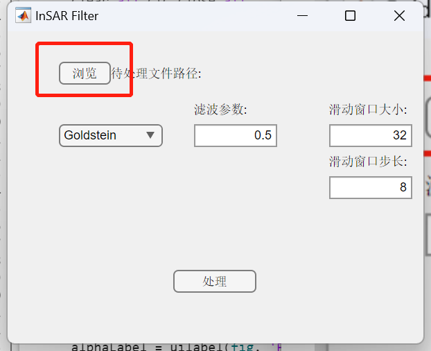
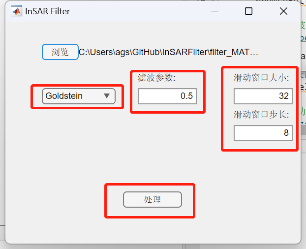

# Goldstein滤波算法及其MATLAB实现

## Requirements

download at:https://disk.pku.edu.cn:443/link/5CB824412F45BBA73FA67BE18DE2F993 

Using Python or other programming languages to implement the interferogram filtering algorithm in the following paper

Goldstein and Werner, 1998, Radar interferogram filtering for geophysical applications, GEOPHYSICAL RESEARCH LETTERS.

The resulting program should accept the following user-controlled parameters

(1) filter strength
(2) filter window size
(3) moving step size of the filter window

For doing test, commonly used filtering parameters are as follows
(1) filter strength: 0.5
(2) filter window size: 32
(3) moving step size of the filter window: 8
You can try different parameters to see the resulting filtering effects.

The interferogram for doing test is also provided. It is a simple 2-d matrix. There is only one band in the image. Each pixel is a complex number, and has a real part and an imaginary part, both in four-byte float format. The interferogram is stored as

real_part imaginary_part real_part imaginary_part ... real_part imaginary_part
real_part imaginary_part real_part imaginary_part ... real_part imaginary_part
...
real_part imaginary_part real_part imaginary_part ... real_part imaginary_part

You can import the interferogram into any image applications, such as Python, Matlab and ENVI. You can view its phase and magnitude. Magnitude usually has a large dynamic range, so you can take its logarithm when displaying it.

Below is the list of the files.

* Goldstein_1998_Radar interferogram filtering for geophysical applications.pdf --- The paper
* diff_150405-150503_10rlks_56alks.int --- the interferogram for doing test
* diff_150405-150503_10rlks_56alks.int.xml --- xml file specifying interferogram size, precision, etc.
* diff_150405-150503_10rlks_56alks.int.tif --- a false color image of the phase of the inteferogram. You should be able to see the same thing in any image applications when you display the interferogram, although you may use a different colormap, e.g. rainbow, jet etc.

Results should include:

* your codes
* experimental results with your codes, e.g. images before and after filtering (such as diff_150405-150503_10rlks_56alks.int.tif), parameters you used for filtering.
* a simple report about your work in which you discuss your insights into the method, e.g., why it works as a filter, possible improvements, etc.

## 要求

下载地址：https://disk.pku.edu.cn:443/link/5CB824412F45BBA73FA67BE18DE2F993

使用Python或其他编程语言来实现以下论文中的干涉图滤波算法。

Goldstein and Werner, 1998, Radar interferogram filtering for geophysical applications, GEOPHYSICAL RESEARCH LETTERS.

由此产生的程序应接受以下用户控制的参数

(1) 滤波强度
(2) 滤波器窗口大小
(3) 滤波窗口的移动步骤大小

在做试验时，常用的滤波参数如下
(1) 滤波强度：0.5
(2) 滤波窗大小：32
(3) 滤波窗的移动步长： 8
你可以尝试不同的参数，看看产生的滤波效果。

还提供了做测试的干涉图。它是一个简单的2维矩阵。图像中只有一个波段。每个像素是一个复数，有一个实部和一个虚部，都是四字节的浮点数格式。干涉图被存储为

real_part imaginary_part real_part imaginary_part ... real_part imaginary_part
real_part imaginary_part real_part imaginary_part ... real_part imaginary_part
...
real_part imaginary_part real_part imaginary_part ... real_part imaginary_part

你可以将干涉图导入任何图像应用程序，如Python、Matlab和ENVI。你可以查看它的相位和幅值。幅值通常有很大的动态范围，所以你可以在显示它时取其对数。

下面是文件的列表。

- Goldstein_1998_地球物理应用中的雷达干涉图滤波.pdf ---该论文

- diff_150405-150503_10rlks_56alks.int ---做测试的干涉图

- diff_150405-150503_10rlks_56alks.int.xml ---指定干涉图大小、精度等的xml文件。

- diff_150405-150503_10rlks_56alks.int.tif ---干涉图的相位的假彩色图像。当你显示干涉图时，你应该能在任何图像应用程序中看到同样的东西，尽管你可以使用不同的颜色映射，如彩虹、喷射等。

你的结果应包括：

- 你的代码

- 用你的代码进行的实验结果，例如过滤前后的图像（如diff_150405-150503_10rlks_56alks.int.tif），你用于过滤的参数。

- 一份关于你的工作的简单报告，在报告中谈谈你对这个方法的见解，例如，为什么它能起到滤波的作用，可能的改进方法等

## 文件说明

`main.m`：程序的主函数，负责调用其他函数并绘制GUI界面；

`goldstein_filter.m`：滤波器函数，使用`goldstein_filter(cpx, alpha, window_size, step_size)`来调用，其中`cpx`代表待处理的干涉图复数矩阵，`alpha`代表滤波参数，`window_size`代表窗口大小，`step_size`代表窗口滑动的步长；

`phase2raster.m`：将干涉图输出为`tif`、`jpeg`、`bmp`等格式的栅格图像；

`read_int.m`：将`int`格式的干涉图数据转换为矩阵；

`write_int.m`：将矩阵保存为`int`形式的干涉图数据；

`data`：放置本工程所需要的相关数据；

`data/original`：放置未经滤波的原图像数据，包含`original.int`、`original.int.tif`和`original.int.xml`

`data/filter_fxx_wyy_szz`：放置滤波后的图像数据，`xx`、`yy`、`zz`分别表示滤波参数、窗口大小、窗口滑动步长，如`filter_f0.5_w32_s8`代表滤波参数为0.5、窗口大小为32、窗口滑动步长为8；

`img`：放置`README`文档的图片。

## 使用指南

1. 运行`main.m`脚本，出现如下界面

2. 点击`浏览`，选择待滤波的`int`文件，此处我们选择`original.int`

3. 设置三个参数完毕后，点击`处理`，稍等片刻（等待时间取决于三个滤波参数的选取）

4. 滤波处理完成后会提示`处理完成`，同时会显示三幅干涉图像，分别是原干涉图像、滤波后的干涉图像、原图像和滤波后图像相位的差值；同时，`/data`文件夹下会出现一个名为`filter_f0.5_w32_s8`的文件夹，用以存储滤波后的数据

